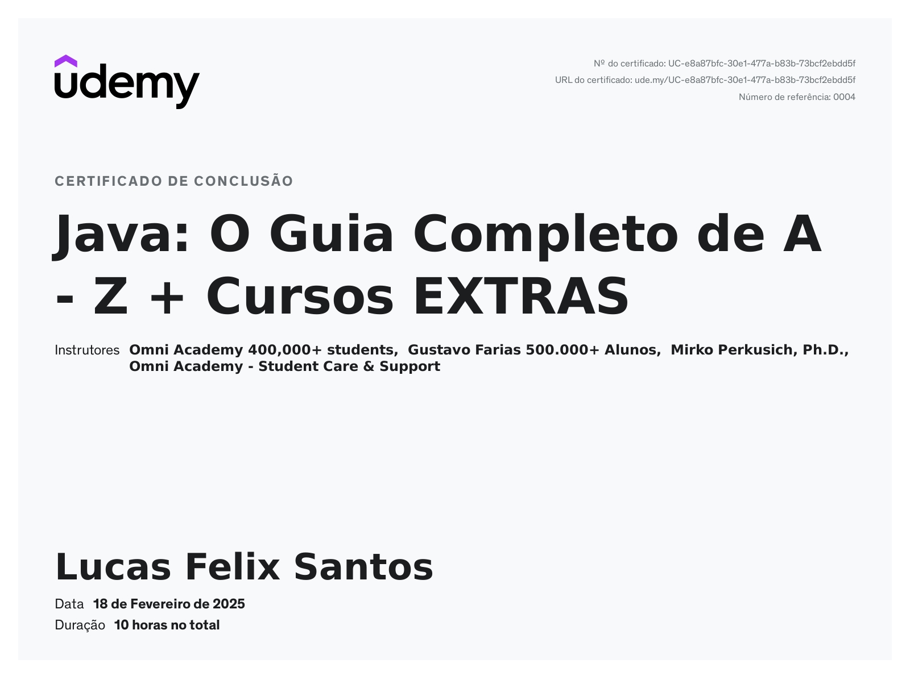
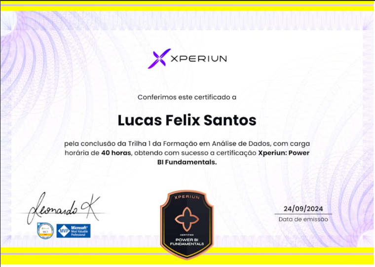
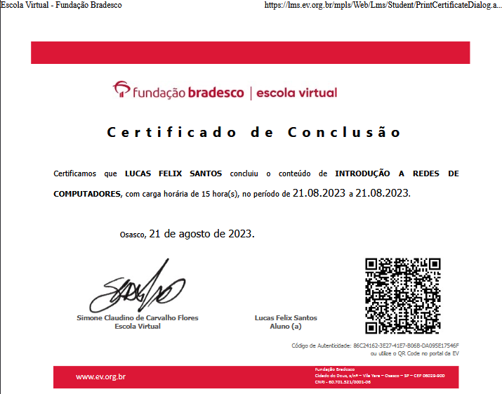
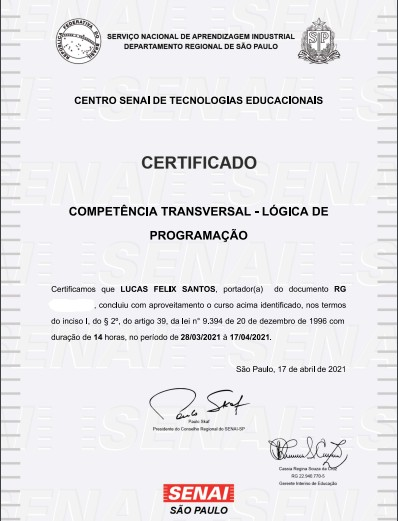

<h1 align="center">Olá, eu me chamo Lucas Felix Santos!</h1>

## Sobre mim

Sou formado em **Sistemas de Informação** e tenho experiência em **Suporte Técnico ao Usuário, Manutenção de Computadores, Infraestrutura de TI, Desenvolvimento de Software e Manutenção de Sistemas**. Sempre fui movido pela curiosidade e pelo desejo de entender como as coisas funcionam por trás dos bastidores. Foi assim que me apaixonei por programação, tecnologia e computadores. Hoje, busco não apenas aprimorar minhas habilidades, mas também contribuir para a comunidade, seja através de projetos, compartilhando conhecimento ou participando de discussões sobre inovação.

## Objetivo Profissional

Busco me tornar um desenvolvedor Java com conhecimento extremamente aprofundado na linguagem e suas principais tecnologias. Meu foco está no aprendizado contínuo, aplicando conceitos por meio de projetos práticos para fortalecer minhas habilidades e me tornar um profissional altamente capacitado. Acredito que a melhor forma de evoluir na área é construindo soluções reais, colaborando com a comunidade e explorando os desafios do desenvolvimento de software.

## O que me move?

O que me move é a iniciativa do **Código Aberto**. Acredito no poder do conhecimento compartilhado, na liberdade de aprender e na construção coletiva de soluções que impactam o mundo. Tecnologia, para mim, vai muito além de escrever código, é sobre transformar ideias em algo útil, acessível e disponível para todos.

---

## Certificados

Aqui estão alguns dos certificados que obtive:

|  |  |  |
|:---:|:---:|:---:|
|  |

---

## Entre em contato comigo

- **📧 E-mail:** [lucasfelixsantos2002@outlook.com](mailto:lucasfelixsantos2002@outlook.com)  
- **💼 LinkedIn:** [linkedin.com/in/dalucasfelixsantos](https://www.linkedin.com/in/dalucasfelixsantos)
